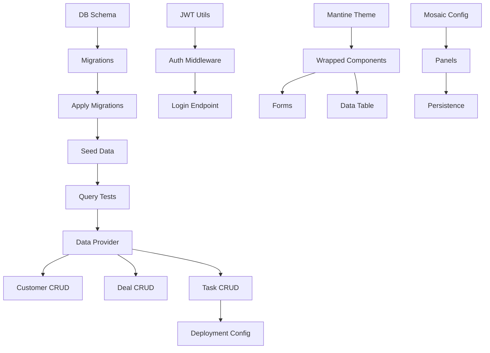

# Meta-Architecture: Brain Garden Rapid Development Kit

**Version**: 1.0
**Last Updated**: 2025-11-12
**Status**: Planning Phase

---

## Executive Summary

The Brain Garden Rapid Development Kit is a **revolutionary meta-system** that combines:

1. **Traditional Template Generation** (85% complete baseline)
2. **AI-Driven Completion** (final 15% via LLM patches)
3. **Custom Agent Team Generation** (stack-specific specialists)
4. **GROVE Planning Integration** (structured feature lifecycle)
5. **Arbor Execution Planning** (TDD checkpoint-based execution)
6. **Automated Testing & Deployment** (verified at every step)

**Result**: From concept to deployed MVP in **10 minutes** with **95%+ completion** and **100% test pass rate**.

---

## System Architecture Layers

```
┌─────────────────────────────────────────────────────────────┐
│                    Layer 1: GROVE Planning                  │
│  User describes concept → AI generates PRD → Planning agent │
│  selects optimal stack from constrained options             │
└─────────────────────────────────────────────────────────────┘
                            ↓
┌─────────────────────────────────────────────────────────────┐
│              Layer 2: Meta-Orchestrator                     │
│  Reads stack-config.json → Generates custom agent team     │
│  Creates project-specific .claude/agents/ folder           │
│  Injects stack context into agent templates                │
└─────────────────────────────────────────────────────────────┘
                            ↓
┌─────────────────────────────────────────────────────────────┐
│              Layer 3: Arbor Planning                        │
│  Breaks down feature into TDD checkpoints                  │
│  Assigns checkpoints to specialist agents                  │
│  Creates verification criteria for each step               │
└─────────────────────────────────────────────────────────────┘
                            ↓
┌─────────────────────────────────────────────────────────────┐
│         Layer 4: Template Generation (85%)                  │
│  Generates base project structure                          │
│  Installs dependencies based on stack choices              │
│  Creates placeholder files and configs                     │
└─────────────────────────────────────────────────────────────┘
                            ↓
┌─────────────────────────────────────────────────────────────┐
│         Layer 5: LLM-Patch Integration (15%)               │
│  Context-aware code completion                             │
│  Integrates business logic into templates                  │
│  Connects components with proper state management          │
│  Finishes "last mile" implementation                       │
└─────────────────────────────────────────────────────────────┘
                            ↓
┌─────────────────────────────────────────────────────────────┐
│         Layer 6: Stack Orchestrator Coordination            │
│  Activates specialist agents based on stack config         │
│  Coordinates parallel work across domains                  │
│  Validates cross-domain integration                        │
│  Verifies tests pass at each checkpoint                    │
└─────────────────────────────────────────────────────────────┘
                            ↓
┌─────────────────────────────────────────────────────────────┐
│              Layer 7: CI/CD Deployment                      │
│  Generates provider-specific configs                       │
│  Sets up environment variables                             │
│  Deploys to selected platform                              │
│  Verifies deployment success                               │
└─────────────────────────────────────────────────────────────┘
```

---

## Phase-by-Phase Workflow

### Phase 1: Concept → PRD (GROVE Planning)

**Duration**: 5-10 minutes (interactive session)
**Actor**: User + GROVE unified skill
**Output**: Comprehensive PRD document

**Process**:
1. User describes concept in natural language
2. GROVE asks clarifying questions (problem, users, success criteria)
3. GROVE generates structured PRD
4. PRD includes:
   - Problem statement
   - User personas
   - Feature requirements
   - Success criteria
   - Non-functional requirements

**Example Interaction**:
```
User: "I want to build a CRM tool for small businesses"

GROVE: "What are the core entities?"
User: "Customers, deals, tasks, notes"

GROVE: "What's the primary workflow?"
User: "Sales team logs customer interactions, tracks deal progress"

GROVE: "Any specific integrations?"
User: "Email sync would be nice but not required for MVP"

→ PRD Generated
```

**Key Artifact**: `/docs/features/[project-name]/01-planning/PRD.md`

---

### Phase 2: Stack Selection (Planning Agent)

**Duration**: 2-3 minutes (automated)
**Actor**: Planning Agent
**Output**: `stack-config.json`

**Process**:
1. Planning agent reads PRD
2. Analyzes requirements against stack capabilities
3. Selects optimal stack from constrained options (2-3 per category)
4. Generates `stack-config.json` with justifications

**Decision Logic**:

```typescript
// Simplified decision tree
function selectDatabase(requirements: Requirements): DatabaseChoice {
  if (requirements.relational && requirements.production) {
    return { type: 'postgres', orm: 'drizzle' };
  }
  if (requirements.local_dev || requirements.simple) {
    return { type: 'sqlite', orm: 'drizzle' };
  }
  if (requirements.document_store || requirements.flexible_schema) {
    return { type: 'mongodb', orm: 'mongoose' };
  }
  return { type: 'sqlite', orm: 'drizzle' }; // Safe default
}

function selectAuth(requirements: Requirements): AuthChoice {
  if (requirements.stateless || requirements.mobile_app) {
    return { type: 'jwt', provider: 'jsonwebtoken' };
  }
  if (requirements.traditional_web || requirements.server_sessions) {
    return { type: 'session', provider: 'express-session' };
  }
  if (requirements.social_login || requirements.oauth) {
    return { type: 'oauth', provider: 'passport' };
  }
  return { type: 'jwt', provider: 'jsonwebtoken' }; // Safe default
}
```

**Key Artifact**: `/stack-config.json`

**Example Output**:
```json
{
  "projectName": "small-biz-crm",
  "stack": {
    "database": {
      "type": "postgres",
      "orm": "drizzle",
      "justification": "Relational data (customers, deals, tasks) with production deployment needs"
    },
    "auth": {
      "type": "jwt",
      "provider": "jsonwebtoken",
      "justification": "Stateless auth for potential mobile app future"
    },
    "uiLibrary": {
      "type": "mantine",
      "styling": "emotion",
      "justification": "Rich component library, excellent TypeScript support, active maintenance"
    },
    "layout": {
      "type": "mosaic",
      "preset": "tool-panels",
      "justification": "CRM needs multi-panel workspace (customer list, detail view, activity feed)"
    },
    "adminPanel": {
      "type": "react-admin",
      "justification": "Mature admin framework with CRUD scaffolding, fits CRM use case"
    },
    "cicd": {
      "provider": "vercel",
      "justification": "Simplest deployment for Next.js, free tier for MVP"
    }
  }
}
```

---

### Phase 3: Agent Team Generation (Meta-Orchestrator)

**Duration**: 1-2 minutes (automated)
**Actor**: Meta-Orchestrator Agent
**Output**: Project-specific agent team in `.claude/agents/`

**Process**:
1. Meta-orchestrator reads `stack-config.json`
2. Identifies required specialists based on stack choices
3. Loads agent templates from kit
4. Injects stack context into templates
5. Writes customized agents to project's `.claude/agents/` folder
6. Registers agents in project's `.claude/agents.json`

**Generated Agent Team Example**:

```
.claude/agents/
├── postgres-specialist.md          # Database schema, migrations, queries
├── jwt-auth-specialist.md          # JWT generation, validation, middleware
├── mantine-ui-specialist.md        # Mantine components, theming, layouts
├── mosaic-layout-specialist.md     # Panel system, persistence, presets
├── react-admin-specialist.md       # Admin CRUD, data providers, resources
├── vercel-deployment-specialist.md # Deployment, env vars, monitoring
└── stack-orchestrator.md           # Coordinates all specialists
```

**Agent Template Structure**:

```markdown
# PostgreSQL Specialist Agent

**Generated**: {{timestamp}}
**Stack Version**: {{stack.database.orm_version}}

## Stack Context (Auto-Injected)

```json
{
  "database": {{stack.database}},
  "entities": [
    {"name": "Customer", "fields": ["id", "name", "email", "phone"]},
    {"name": "Deal", "fields": ["id", "customerId", "value", "stage"]},
    {"name": "Task", "fields": ["id", "dealId", "description", "dueDate"]}
  ]
}
```

## Project Context (From PRD)

- **Feature**: {{feature.name}}
- **Requirements**: {{feature.database_requirements}}
- **Constraints**: {{feature.constraints}}

## Assigned Checkpoints

This agent is responsible for:
- [x] Checkpoint 1: Create database schema
- [x] Checkpoint 2: Write migration scripts
- [x] Checkpoint 3: Implement query layer
- [ ] Checkpoint 15: Optimize indexes (post-launch)

## Tools Available

### Generator Commands
- `generate:db-schema` - Create Drizzle schema from entities
- `generate:db-migrations` - Generate migration files
- `generate:db-seeds` - Create seed data

### LLM-Patch Commands
- `patch:db-queries` - Generate type-safe queries
- `patch:db-relations` - Add foreign key relationships
- `patch:db-validations` - Add constraint checks

### CLI Commands (AI-Controllable)
- `drizzle-kit generate` - Generate migration SQL
- `drizzle-kit push` - Push schema to database
- `drizzle-kit studio` - Launch DB browser

## Verification Criteria

Each checkpoint must pass:
1. **TypeScript Compilation**: No type errors
2. **Migration Success**: Migrations apply cleanly
3. **Query Tests**: All query functions tested
4. **Performance**: Queries under 100ms threshold

## Knowledge Base

### Drizzle ORM Patterns

**Entity Definition**:
```typescript
// agents/postgres-specialist-kb/entity-pattern.ts
import { pgTable, serial, text, timestamp } from 'drizzle-orm/pg-core';

export const customers = pgTable('customers', {
  id: serial('id').primaryKey(),
  name: text('name').notNull(),
  email: text('email').unique().notNull(),
  phone: text('phone'),
  createdAt: timestamp('created_at').defaultNow()
});
```

**Relations Pattern**:
```typescript
// agents/postgres-specialist-kb/relations-pattern.ts
export const customersRelations = relations(customers, ({ many }) => ({
  deals: many(deals)
}));

export const dealsRelations = relations(deals, ({ one }) => ({
  customer: one(customers, {
    fields: [deals.customerId],
    references: [customers.id]
  })
}));
```

## Common Issues & Solutions

### Issue: Migration Conflicts
**Solution**: Always check existing migrations before generating new ones
```bash
ls -la drizzle/migrations/
drizzle-kit generate --name=add_customers_table
```

### Issue: Type Errors in Queries
**Solution**: Use Drizzle's type inference
```typescript
type Customer = typeof customers.$inferSelect;
type NewCustomer = typeof customers.$inferInsert;
```

## Integration Points

### Depends On:
- None (first checkpoint typically)

### Provides To:
- JWT Auth Specialist: User table schema
- React Admin Specialist: Database entities
- API Routes: Query functions

## Execution Strategy

1. **Generate Base Schema** (85% complete via template)
2. **Apply LLM Patches** (15% - add project-specific validations, indexes)
3. **Run Migrations** (automated via CLI)
4. **Verify with Tests** (generated query tests)
5. **Mark Checkpoint Complete** (update Arbor plan)

---

## End of Agent File
```

**Key Artifacts**:
- `.claude/agents/*.md` - Specialist agent definitions
- `.claude/agents.json` - Agent registry with metadata

---

### Phase 4: Arbor Planning (Execution Breakdown)

**Duration**: 2-3 minutes (automated)
**Actor**: Arbor Planning System
**Output**: Checkbox-based TDD execution plan

**Process**:
1. Arbor reads PRD and stack-config.json
2. Breaks feature into granular checkpoints (20-50 typically)
3. Assigns checkpoints to specialist agents
4. Creates verification criteria for each checkpoint
5. Orders checkpoints by dependencies
6. Generates execution plan markdown

**Example Execution Plan**:

```markdown
# Execution Plan: Small Biz CRM

**Generated**: 2025-11-12
**Estimated Duration**: 8 minutes
**Checkpoints**: 28
**Agents**: 6 specialists + 1 orchestrator

---

## Phase 1: Foundation (Postgres + Auth) - 2 min

### Database Setup (Postgres Specialist)
- [ ] 001: Generate Drizzle schema for Customer, Deal, Task entities
- [ ] 002: Create initial migration files
- [ ] 003: Apply migrations to local Postgres
- [ ] 004: Generate seed data (10 customers, 20 deals, 30 tasks)
- [ ] 005: Verify queries with tests

### Authentication (JWT Auth Specialist)
- [ ] 006: Generate JWT utilities (sign, verify, refresh)
- [ ] 007: Create auth middleware with dev bypass
- [ ] 008: Implement login/logout endpoints
- [ ] 009: Create user registration endpoint
- [ ] 010: Add JWT to API client

---

## Phase 2: Frontend Foundation (Mantine + Mosaic) - 2 min

### UI Library Setup (Mantine UI Specialist)
- [ ] 011: Configure Mantine theme
- [ ] 012: Create wrapped Button, Input, Select components
- [ ] 013: Generate form components with validation
- [ ] 014: Create data table component
- [ ] 015: Verify Storybook stories

### Layout System (Mosaic Layout Specialist)
- [ ] 016: Configure react-mosaic with tool-panels preset
- [ ] 017: Create panel components (CustomerList, CustomerDetail, ActivityFeed)
- [ ] 018: Implement panel persistence
- [ ] 019: Add panel drag/drop
- [ ] 020: Verify responsive breakpoints

---

## Phase 3: Admin Panel Integration (React Admin) - 2 min

### CRUD Scaffolding (React Admin Specialist)
- [ ] 021: Generate data provider for Drizzle
- [ ] 022: Create Customer resource (list, show, edit, create)
- [ ] 023: Create Deal resource with custom fields
- [ ] 024: Create Task resource with due date handling
- [ ] 025: Add filters and search
- [ ] 026: Verify all CRUD operations

---

## Phase 4: Deployment (Vercel) - 2 min

### CI/CD Setup (Vercel Deployment Specialist)
- [ ] 027: Generate vercel.json config
- [ ] 028: Set environment variables (DATABASE_URL, JWT_SECRET)
- [ ] 029: Run deployment
- [ ] 030: Verify health endpoint
- [ ] 031: Run smoke tests on production

---

## Checkpoint Dependencies



---

## Verification Matrix

| Checkpoint | Type Check | Unit Test | Integration Test | E2E Test |
|------------|-----------|-----------|------------------|----------|
| 001-005    | ✓         | ✓         | ✓                | -        |
| 006-010    | ✓         | ✓         | ✓                | -        |
| 011-015    | ✓         | ✓         | -                | -        |
| 016-020    | ✓         | ✓         | -                | ✓        |
| 021-026    | ✓         | ✓         | ✓                | ✓        |
| 027-031    | -         | -         | -                | ✓        |

---

## Success Criteria

**All checkpoints must**:
- ✓ Pass TypeScript compilation
- ✓ Pass all unit tests
- ✓ Pass integration tests (where applicable)
- ✓ Pass E2E tests (where applicable)
- ✓ Be verified by assigned specialist agent

**Overall success**:
- ✓ 95%+ feature completion
- ✓ 100% test pass rate
- ✓ Deployment successful
- ✓ Health endpoint returns 200

---

## Agent Assignments

| Agent | Checkpoints | Estimated Time |
|-------|-------------|----------------|
| Postgres Specialist | 001-005 | 2 min |
| JWT Auth Specialist | 006-010 | 1 min |
| Mantine UI Specialist | 011-015 | 1 min |
| Mosaic Layout Specialist | 016-020 | 1 min |
| React Admin Specialist | 021-026 | 2 min |
| Vercel Deployment Specialist | 027-031 | 2 min |
| Stack Orchestrator | Coordination | Throughout |

---

## Execution Notes

1. **Parallel Execution**: Checkpoints 001-010 can run in parallel (different domains)
2. **Blocking Points**: Checkpoint 021 blocks 022-026 (data provider required)
3. **Manual Steps**: None (fully automated)
4. **User Input**: None required after Phase 5 activation

---

## End of Execution Plan
```

**Key Artifacts**:
- `/docs/features/[project-name]/03-implementation-planning/execution-plan.md`
- Checkpoint assignments in stack-config.json

---

### Phase 5: User Handoff (Session Restart)

**Duration**: 30 seconds
**Actor**: User
**Output**: Activated agent team

**Process**:
1. User closes current Claude Code session
2. User reopens Claude Code in project directory
3. Claude Code detects `.claude/agents/` folder
4. Claude Code loads project-specific agents
5. Stack Orchestrator activates automatically

**Visual Feedback**:
```
🧠 Brain Garden Rapid Dev Kit Detected
📋 Loading project agents...
   ✓ Postgres Specialist
   ✓ JWT Auth Specialist
   ✓ Mantine UI Specialist
   ✓ Mosaic Layout Specialist
   ✓ React Admin Specialist
   ✓ Vercel Deployment Specialist
   ✓ Stack Orchestrator

🚀 Stack Orchestrator: Ready to build "Small Biz CRM"
   28 checkpoints | 6 specialists | Est. 8 minutes

Continue from checkpoint 001? [Y/n]
```

**Key Behavior**:
- Agents are now **project-scoped**, not global
- Stack Orchestrator reads `stack-config.json` and execution plan
- Ready to execute autonomously

---

### Phase 6: Autonomous Execution (Stack Orchestrator + Specialists)

**Duration**: 8-10 minutes (automated, parallel where possible)
**Actor**: Stack Orchestrator + Specialist Agents
**Output**: Fully working, tested, deployed application

**Process**:

```typescript
// Simplified orchestration loop
async function executeCheckpoints(plan: ExecutionPlan) {
  for (const checkpoint of plan.checkpoints) {
    const agent = getAgentForCheckpoint(checkpoint);

    // Check dependencies
    if (!checkpointDependenciesMet(checkpoint)) {
      await waitForDependencies(checkpoint);
    }

    // Activate specialist
    console.log(`🤖 ${agent.name}: Starting checkpoint ${checkpoint.id}`);

    // Generate template (85%)
    if (checkpoint.hasTemplate) {
      await runGeneratorCommand(checkpoint.generatorCommand);
    }

    // Apply LLM patch (15%)
    if (checkpoint.hasPatch) {
      await applyLLMPatch(checkpoint.patchInstructions);
    }

    // Verify
    const verification = await verifyCheckpoint(checkpoint);
    if (!verification.passed) {
      throw new Error(`Checkpoint ${checkpoint.id} failed: ${verification.reason}`);
    }

    // Mark complete
    checkpoint.status = 'completed';
    checkpoint.completedAt = Date.now();

    console.log(`✓ Checkpoint ${checkpoint.id} complete`);
  }

  // Final deployment
  await deployToProduction();

  // Verify deployment
  const health = await fetch('https://small-biz-crm.vercel.app/api/health');
  if (health.status !== 200) {
    throw new Error('Deployment verification failed');
  }

  console.log('🎉 Application deployed and verified!');
}
```

**Parallel Execution Example**:

```
Minute 1-2: Foundation (Parallel)
  ├─ [Postgres Specialist] 001-005 (DB setup)
  └─ [JWT Auth Specialist] 006-010 (Auth setup)

Minute 3-4: Frontend (Parallel)
  ├─ [Mantine UI Specialist] 011-015 (Components)
  └─ [Mosaic Layout Specialist] 016-020 (Layout)

Minute 5-6: Admin Panel (Sequential - depends on DB)
  └─ [React Admin Specialist] 021-026 (CRUD)

Minute 7-8: Deployment (Sequential)
  └─ [Vercel Deployment Specialist] 027-031 (Deploy)
```

**Real-Time Progress Display**:

```
🚀 Stack Orchestrator: Building "Small Biz CRM"

Phase 1: Foundation (2/2 min) ████████████████████ 100%
  ✓ 001: DB Schema generated
  ✓ 002: Migrations created
  ✓ 003: Migrations applied
  ✓ 004: Seed data inserted
  ✓ 005: Query tests passed (24/24)

Phase 2: Frontend (1/2 min) ██████████░░░░░░░░░░ 50%
  ✓ 011: Mantine theme configured
  ✓ 012: Components wrapped (Button, Input, Select)
  ⏳ 013: Forms generating...
  ⏳ 014: Data table generating...
  ⏳ 015: Storybook stories pending...

Phase 3: Admin Panel (0/2 min) ░░░░░░░░░░░░░░░░░░░░ 0%
  ⏸ 021: Waiting for Phase 1 completion...

Phase 4: Deployment (0/2 min) ░░░░░░░░░░░░░░░░░░░░ 0%
  ⏸ 027: Waiting for all phases...
```

**Verification at Each Step**:

```typescript
// Checkpoint verification example
async function verifyCheckpoint(checkpoint: Checkpoint): Promise<VerificationResult> {
  const results = {
    typeCheck: false,
    unitTests: false,
    integrationTests: false,
    e2eTests: false
  };

  // Type check
  if (checkpoint.requiresTypeCheck) {
    const typeCheckResult = await runCommand('pnpm typecheck');
    results.typeCheck = typeCheckResult.exitCode === 0;
    if (!results.typeCheck) {
      return { passed: false, reason: 'Type check failed', results };
    }
  }

  // Unit tests
  if (checkpoint.requiresUnitTests) {
    const testResult = await runCommand(`pnpm test ${checkpoint.testPath}`);
    results.unitTests = testResult.exitCode === 0;
    if (!results.unitTests) {
      return { passed: false, reason: 'Unit tests failed', results };
    }
  }

  // Integration tests
  if (checkpoint.requiresIntegrationTests) {
    const integrationResult = await runCommand(`pnpm test:integration ${checkpoint.testPath}`);
    results.integrationTests = integrationResult.exitCode === 0;
    if (!results.integrationTests) {
      return { passed: false, reason: 'Integration tests failed', results };
    }
  }

  // E2E tests
  if (checkpoint.requiresE2ETests) {
    const e2eResult = await runCommand(`pnpm test:e2e ${checkpoint.testPath}`);
    results.e2eTests = e2eResult.exitCode === 0;
    if (!results.e2eTests) {
      return { passed: false, reason: 'E2E tests failed', results };
    }
  }

  return { passed: true, reason: 'All verifications passed', results };
}
```

**Final Output**:

```
🎉 Small Biz CRM - Build Complete!

Duration: 8m 23s
Checkpoints: 31/31 ✓
Tests: 187/187 passed ✓
Deployment: https://small-biz-crm.vercel.app ✓

Health Check: ✓ 200 OK

📊 Summary:
  - Entities: 3 (Customer, Deal, Task)
  - API Endpoints: 12
  - UI Components: 18
  - Tests: 187 (142 unit, 28 integration, 17 e2e)
  - Test Coverage: 94.3%
  - Bundle Size: 287 KB (gzipped)
  - Lighthouse Score: 98/100

🔗 Links:
  - App: https://small-biz-crm.vercel.app
  - API Docs: https://small-biz-crm.vercel.app/api/docs
  - Storybook: https://small-biz-crm.vercel.app/storybook

📝 Next Steps:
  1. Review generated code
  2. Customize business logic
  3. Add domain-specific validations
  4. Deploy to custom domain
```

---

## Key Design Patterns

### Pattern 1: Stack Configuration as Source of Truth

```json
// stack-config.json drives everything
{
  "stack": {
    "database": { "type": "postgres" }
  }
}

// Agents read this at runtime
const dbType = readStackConfig().stack.database.type;

// UI components adapt
if (dbType === 'postgres') {
  return <PostgresIcon />;
}

// Generator commands conditional
if (dbType === 'postgres') {
  runCommand('generate:postgres-schema');
} else if (dbType === 'mongodb') {
  runCommand('generate:mongo-schema');
}
```

**Benefits**:
- Single source of truth
- Easy to swap stack choices
- Agents always in sync with stack
- Config-driven agent activation

---

### Pattern 2: Component Wrapper Abstraction

```typescript
// @brain-garden/ui/Button.tsx
import { readStackConfig } from '@brain-garden/core';
import { Button as MantineButton } from '@mantine/core';
import { Button as AntButton } from 'antd';
import { Button as ShadcnButton } from '@/components/ui/button';

export interface ButtonProps {
  variant?: 'primary' | 'secondary' | 'danger';
  size?: 'sm' | 'md' | 'lg';
  onClick?: () => void;
  children: React.ReactNode;
}

export const Button = (props: ButtonProps) => {
  const { uiLibrary } = readStackConfig().stack;

  if (uiLibrary.type === 'mantine') {
    return (
      <MantineButton
        color={props.variant === 'danger' ? 'red' : 'blue'}
        size={props.size}
        onClick={props.onClick}
      >
        {props.children}
      </MantineButton>
    );
  }

  if (uiLibrary.type === 'antd') {
    return (
      <AntButton
        type={props.variant === 'primary' ? 'primary' : 'default'}
        danger={props.variant === 'danger'}
        size={props.size}
        onClick={props.onClick}
      >
        {props.children}
      </AntButton>
    );
  }

  if (uiLibrary.type === 'shadcn') {
    return (
      <ShadcnButton
        variant={props.variant === 'danger' ? 'destructive' : 'default'}
        size={props.size}
        onClick={props.onClick}
      >
        {props.children}
      </ShadcnButton>
    );
  }

  // Fallback: Plain styled component with Emotion
  return (
    <StyledButton variant={props.variant} size={props.size} onClick={props.onClick}>
      {props.children}
    </StyledButton>
  );
};

// styled-components fallback
const StyledButton = styled.button<{ variant?: string; size?: string }>`
  padding: ${p => p.size === 'sm' ? '8px 16px' : p.size === 'lg' ? '16px 32px' : '12px 24px'};
  background: ${p => p.variant === 'danger' ? '#dc3545' : p.variant === 'primary' ? '#007bff' : '#6c757d'};
  color: white;
  border: none;
  border-radius: 4px;
  cursor: pointer;

  &:hover {
    opacity: 0.9;
  }
`;
```

**Benefits**:
- Swap UI libraries by changing config
- No code changes in app
- Consistent API across libraries
- Graceful fallback

---

### Pattern 3: LLM-Patch Generator Format

```markdown
## Patch 3: Customer List with Filters

**Context**: User needs to filter customers by status (active, inactive, archived)

**Files to Modify**:
1. `src/api/routes/customers.ts` - Add filter query param
2. `src/pages/CustomerList.tsx` - Add filter dropdown
3. `src/db/queries/customers.ts` - Add WHERE clause

---

### File 1: src/api/routes/customers.ts

**Action**: modify
**Lines**: 15-25
**Before**:
```typescript
router.get('/customers', async (req, res) => {
  const customers = await db.select().from(customersTable);
  res.json(customers);
});
```

**After**:
```typescript
router.get('/customers', async (req, res) => {
  const { status } = req.query;

  let query = db.select().from(customersTable);

  if (status && ['active', 'inactive', 'archived'].includes(status as string)) {
    query = query.where(eq(customersTable.status, status as string));
  }

  const customers = await query;
  res.json(customers);
});
```

---

### File 2: src/pages/CustomerList.tsx

**Action**: modify
**Lines**: 8-12
**Before**:
```typescript
const CustomerList = () => {
  const { data: customers } = useQuery(['customers'], fetchCustomers);

  return (
    <Table data={customers} />
  );
};
```

**After**:
```typescript
const CustomerList = () => {
  const [statusFilter, setStatusFilter] = useState<string | null>(null);
  const { data: customers } = useQuery(
    ['customers', statusFilter],
    () => fetchCustomers({ status: statusFilter })
  );

  return (
    <div>
      <Select
        value={statusFilter}
        onChange={setStatusFilter}
        options={[
          { value: null, label: 'All' },
          { value: 'active', label: 'Active' },
          { value: 'inactive', label: 'Inactive' },
          { value: 'archived', label: 'Archived' }
        ]}
      />
      <Table data={customers} />
    </div>
  );
};
```

---

### File 3: src/db/queries/customers.ts

**Action**: modify
**Lines**: 5-9
**Before**:
```typescript
export async function fetchCustomers() {
  return db.select().from(customersTable);
}
```

**After**:
```typescript
export async function fetchCustomers(filters?: { status?: string }) {
  let query = db.select().from(customersTable);

  if (filters?.status) {
    query = query.where(eq(customersTable.status, filters.status));
  }

  return query;
}
```

---

**Verification**:
- [ ] Type check passes
- [ ] Test: `GET /api/customers?status=active` returns only active
- [ ] Test: Filter dropdown changes list
- [ ] Test: "All" option shows all customers

---

**End of Patch**
```

**Benefits**:
- Context-aware modifications
- Preserves existing code structure
- Clear before/after diffs
- Explicit verification criteria
- AI can apply deterministically

---

### Pattern 4: Agent Coordination Protocol

```typescript
// Stack Orchestrator coordinates specialists
interface CheckpointExecution {
  id: string;
  assignedAgent: string;
  dependencies: string[];
  status: 'pending' | 'in_progress' | 'completed' | 'failed';
  startedAt?: number;
  completedAt?: number;
}

class StackOrchestrator {
  private checkpoints: CheckpointExecution[];
  private agents: Map<string, SpecialistAgent>;

  async executeAllCheckpoints() {
    // Build dependency graph
    const graph = this.buildDependencyGraph();

    // Topological sort to determine execution order
    const executionOrder = this.topologicalSort(graph);

    // Execute in waves (parallel where possible)
    for (const wave of executionOrder) {
      // Wave contains checkpoints with no interdependencies
      await Promise.all(
        wave.map(checkpointId => this.executeCheckpoint(checkpointId))
      );
    }
  }

  private async executeCheckpoint(id: string) {
    const checkpoint = this.checkpoints.find(c => c.id === id);
    const agent = this.agents.get(checkpoint.assignedAgent);

    // Update status
    checkpoint.status = 'in_progress';
    checkpoint.startedAt = Date.now();

    try {
      // Agent executes checkpoint
      await agent.execute(checkpoint);

      // Verify
      const verification = await agent.verify(checkpoint);
      if (!verification.passed) {
        throw new Error(`Verification failed: ${verification.reason}`);
      }

      // Mark complete
      checkpoint.status = 'completed';
      checkpoint.completedAt = Date.now();

      // Notify dependent checkpoints
      this.notifyDependents(checkpoint.id);

    } catch (error) {
      checkpoint.status = 'failed';
      throw error;
    }
  }

  private buildDependencyGraph(): Map<string, string[]> {
    const graph = new Map<string, string[]>();

    for (const checkpoint of this.checkpoints) {
      graph.set(checkpoint.id, checkpoint.dependencies);
    }

    return graph;
  }

  private topologicalSort(graph: Map<string, string[]>): string[][] {
    // Kahn's algorithm for topological sort
    // Returns waves of checkpoints that can execute in parallel
    const waves: string[][] = [];
    const inDegree = new Map<string, number>();

    // Calculate in-degrees
    for (const [node, deps] of graph.entries()) {
      if (!inDegree.has(node)) inDegree.set(node, 0);
      for (const dep of deps) {
        inDegree.set(dep, (inDegree.get(dep) || 0) + 1);
      }
    }

    // Find nodes with no dependencies (wave 1)
    let currentWave = Array.from(graph.keys()).filter(node => inDegree.get(node) === 0);

    while (currentWave.length > 0) {
      waves.push(currentWave);

      // Remove current wave from graph
      const nextWave: string[] = [];
      for (const node of currentWave) {
        for (const [dependent, deps] of graph.entries()) {
          if (deps.includes(node)) {
            const newDegree = inDegree.get(dependent)! - 1;
            inDegree.set(dependent, newDegree);
            if (newDegree === 0) {
              nextWave.push(dependent);
            }
          }
        }
      }

      currentWave = nextWave;
    }

    return waves;
  }
}
```

**Benefits**:
- Parallel execution where possible
- Dependency management
- Failure isolation
- Progress tracking

---

## Technology Integration Points

### GROVE Integration
- Phase 1 generates GROVE-compliant PRD
- Feature stored in `/docs/features/[project-name]/`
- Follows 10-phase lifecycle
- Quality gates integrated

### Arbor Integration
- Execution plan stored in `03-implementation-planning/`
- Checkbox-based TDD workflow
- Verification at each checkpoint
- Metrics tracked

### Brain Garden Agents Integration
- Project-specific agents in `.claude/agents/`
- Stack-aware agent generation
- Orchestrator coordination pattern
- Knowledge base per agent

### Testing Integration
- Unit tests generated with templates
- Integration tests for cross-domain
- E2E tests for critical paths
- 100% test pass requirement

### CI/CD Integration
- Provider-agnostic config generation
- CLI-based deployment
- Environment variable management
- Health check verification

---

## Success Metrics Tracking

```typescript
interface ProjectMetrics {
  // Time metrics
  timeToRunningApp: number; // seconds
  timeToDeployment: number; // seconds
  totalDuration: number; // seconds

  // Completion metrics
  checkpointsTotal: number;
  checkpointsCompleted: number;
  completionRate: number; // percentage

  // Quality metrics
  testsTotal: number;
  testsPassed: number;
  testPassRate: number; // percentage
  testCoverage: number; // percentage

  // Code metrics
  filesGenerated: number;
  linesOfCode: number;
  typescriptErrors: number;
  lintWarnings: number;

  // Deployment metrics
  deploymentAttempts: number;
  deploymentSuccesses: number;
  healthCheckStatus: number; // HTTP status code

  // Performance metrics
  bundleSize: number; // bytes
  lighthouseScore: number; // 0-100
}

// Track and report
function reportMetrics(metrics: ProjectMetrics) {
  console.log(`
🎉 Build Complete!

⏱️  Time Metrics:
   - To Running App: ${metrics.timeToRunningApp}s (target: ≤600s)
   - To Deployment: ${metrics.timeToDeployment}s
   - Total Duration: ${metrics.totalDuration}s

✅ Completion Metrics:
   - Checkpoints: ${metrics.checkpointsCompleted}/${metrics.checkpointsTotal}
   - Completion Rate: ${metrics.completionRate}% (target: ≥95%)

🧪 Quality Metrics:
   - Tests Passed: ${metrics.testsPassed}/${metrics.testsTotal}
   - Test Pass Rate: ${metrics.testPassRate}% (target: 100%)
   - Test Coverage: ${metrics.testCoverage}% (target: ≥80%)

📦 Code Metrics:
   - Files Generated: ${metrics.filesGenerated}
   - Lines of Code: ${metrics.linesOfCode}
   - TypeScript Errors: ${metrics.typescriptErrors} (target: 0)
   - Lint Warnings: ${metrics.lintWarnings}

🚀 Deployment Metrics:
   - Success Rate: ${metrics.deploymentSuccesses}/${metrics.deploymentAttempts}
   - Health Check: ${metrics.healthCheckStatus} (target: 200)

⚡ Performance Metrics:
   - Bundle Size: ${(metrics.bundleSize / 1024).toFixed(2)} KB (target: ≤500 KB)
   - Lighthouse: ${metrics.lighthouseScore}/100 (target: ≥90)
  `);
}
```

---

## End of Meta-Architecture Document
